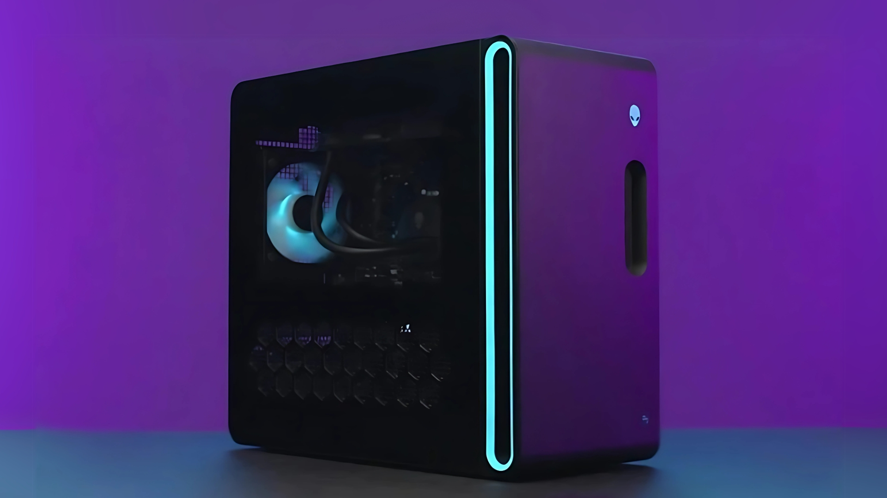
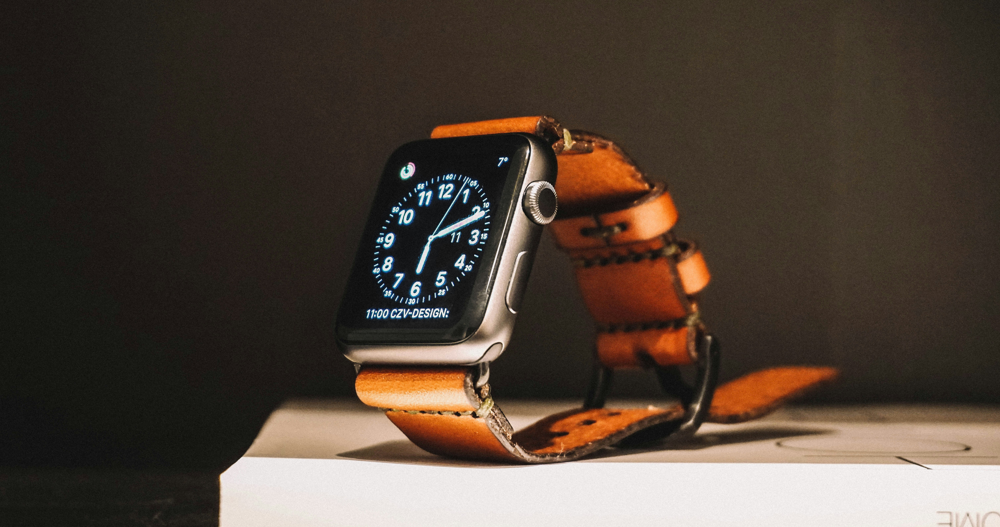
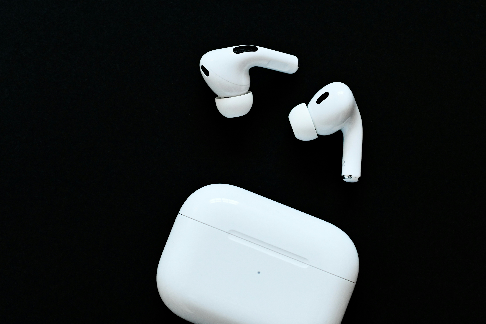
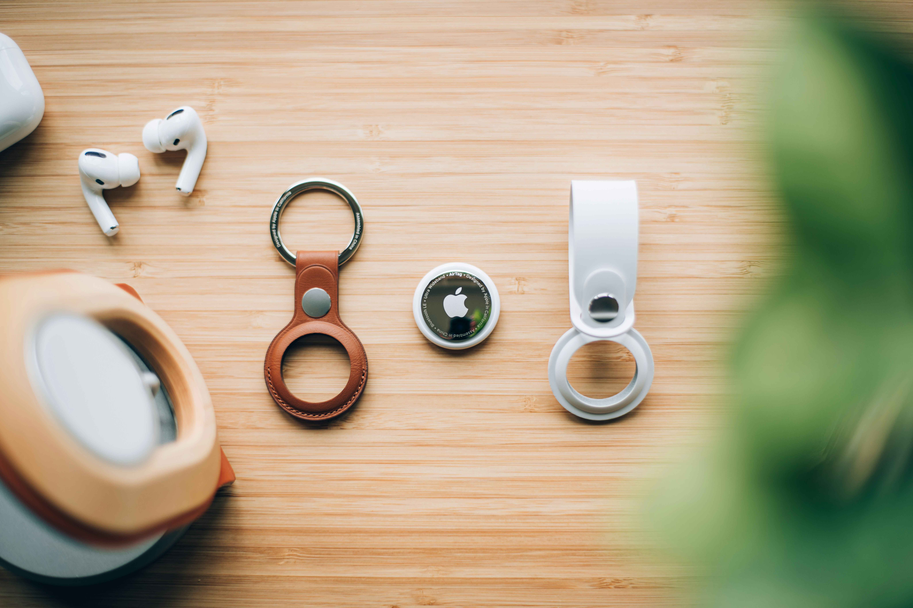
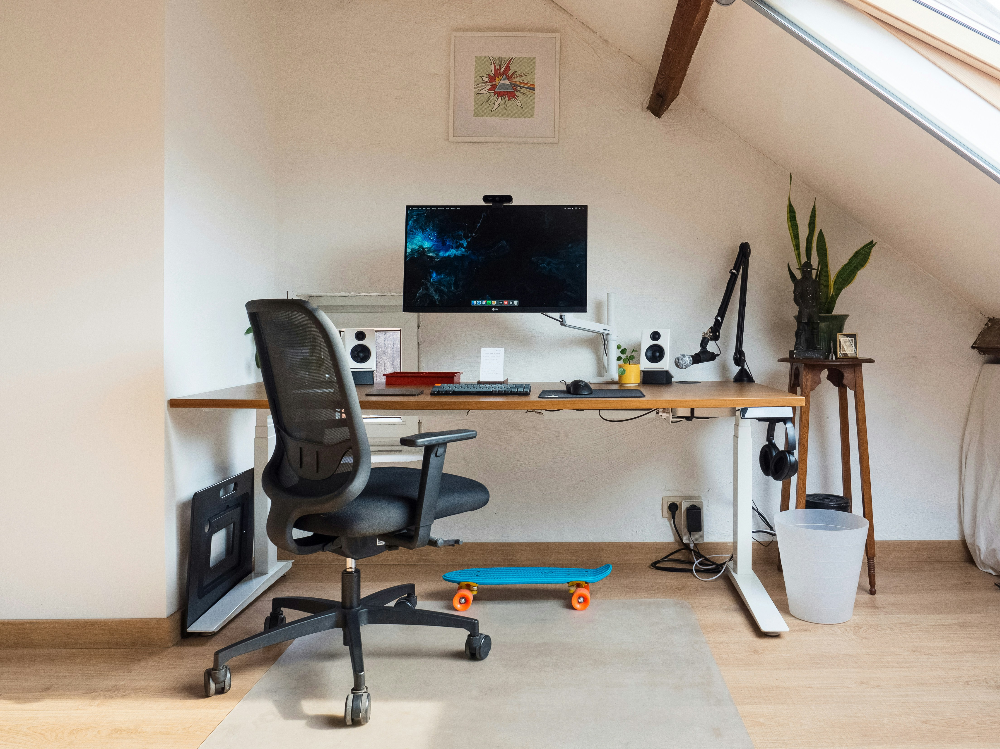
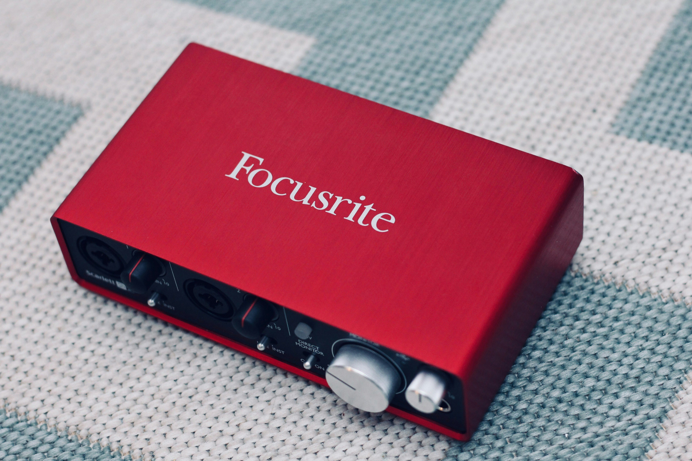
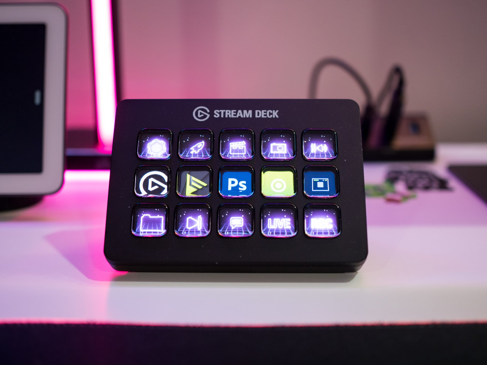

# 2024 Black Friday Tech Recommendations

## Hi there, Cyber Wonders

It’s Black Friday again! Today, I’m sharing some of my all-time favorite tech products that have genuinely improved my quality of life and boosted my happiness.

### About Me

Hi, I am Cyan! I’m a aspiring anime artist and singer, with over a decade of experience as a coding enthusiast. For the past few years, I worked for Google in North America, and in my spare time, I run a YouTube channel filled with gaming, covers, videos, and live streams. I’m also the fiancée of Hoshino Lina, a Linux kernel developer for Asahi Linux. These recommendations are treasures that have greatly helped us in work efficiency, creative endeavors, and relaxation.

Let’s dive right in!

---


### **1. MacBook Air / MacBook Pro (For Everyone)**
- **Why I Recommend It**: MacBooks have been my go-to machine for college, grad school, and work at Google. They’re fantastic for coding, drawing, and recording. My 2014 MacBook Air lasted me seven years before I upgraded to a Pro, which handles video editing, Minecraft, VTube Studio, and streaming like a champ. Both the M1 and M2 models now support Asahi Linux, with M3 and M4 support in the future. Air does great for most people. Need performance for video editing, AI training, or intensive coding tasks? Grab the Pro.
- [Check it out](https://www.dealmoon.com/en/round-up-amazon-apple-device/3434717.html)

---


### **2. iPad (For Students, Artists, and Media Creators)**
- **Why I Recommend It**: It’s a perfect blend of work and play. Add a keyboard, and it’s almost like a mini computer. For someone like me who loves taking notes and drawing, paired with the Apple Pencil and a paper-like screen protector, it feels like a digital notebook/sketchbook that can be archived. It’s also my main tool for creating anime-style art. While I don’t recommend iPads as a primary coding device for CS students—SSH over school networks can be unreliable—it’s a fantastic secondary productivity tool.
- **Black Friday Deal**: Save $100–$200  
- [Check it out](https://www.dealmoon.com/en/round-up-amazon-apple-device/3434717.html)

---



### **3. Alienware Gaming Desktop**
- **Why I Recommend It**: This was my first streaming machine. It’s not the cheapest, but it’s reliable out of the box. OBS streaming is seamless, and it handles graphics-heavy games like Cyberpunk 2077 (with 4080/4090 GPUs) effortlessly. If you have the budget and want a pre-built desktop, this is it. 
- [Check it out](https://m.dealmoon.com/en/round-up-dell-black-friday-sale/3171307.html)

---



### **4. Apple Watch Series 10**
- **Why I Recommend It**: I got this for health reasons and its integration with the Apple ecosystem. It monitors heart rate, sleep, and a few potentially life-saving features. My favorite part is the Walkie-Talkie feature. It’s like having a private intercom system at home. Make sure to try different bands; rubber ones may cause irritation if worn for too long.
- **Black Friday Deal**: $379 (Rose Gold)  
- [Check it out](https://m.dealmoon.com/en/379-apple-watch-series-10-gps-46mm-case/4588327.html)

---


### **5. Herman Miller Ergonomic Chair**
- **Why I Recommend It**: Sitting properly is crucial for health. After my father underwent a life-threatening surgery due to poor posture, I realized how important a good chair is. I’ve tried gaming chairs, kneeling chairs, IKEA’s MARKUS, and more, but Herman Miller chairs are the only ones that keep my back pain-free for hours. They’re pricey, but they’re worth it for those who work long hours. Pro tip: Check secondhand markets for great deals! The second-hand chairs from big companies are usually much cheaper and really good for your back.
- **Black Friday Deal**: 15%–25% off  
- [Check it out](https://store.hermanmiller.com/holiday-sale/constant/ergonomic-office-chairs-hm_gaming-chairs_office-stools_task-chairs)

---



### **6. AirPods Pro**
- **Why I Recommend It**: These are my most essential tools. From music playback and Siri interactions to ASMR meditations at night, they’re perfect. While the regular AirPods can easily fall out during sleep, the Pro model is much more secure and comfortable for extended wear.
- **Black Friday Deal**: $169.99 ($80 off)  
- [Check it out](https://www.dealmoon.com/en/168-apple-airpods-pro-2nd-generation/4513916.html)

---



### **7. AirTag**
- **Why I Recommend It**: I have around 12 of these at home—they’re just that useful! Each pet gets one on their collar, and thanks to the “Find My” feature, I’ve recovered my runaway cats and dogs countless times. They can literally be life-saving. They’re also great for tracking wallets, purses, bags, keys, and more. Remember, the batteries will need replacing eventually. Creators, beware of receiving gifts with hidden trackers inside. When traveling, stay vigilant for unknown AirTags—you’ll receive an alert on your iPhone if one is near.
- **Black Friday Deal**: 4-pack for just $72.99  
- [Check it out](https://m.dealmoon.com/en/69-apple-airtag-4-pack/4587103.html)

---


### **8. Fujifilm Instax Mini 12 Instant Camera**
- **Why I Recommend It**: Why bother with an instant camera in the smartphone age? Because physical photos carry so many memories. Clip them onto a string and create a photo wall—super romantic!
- **Black Friday Deal**: Bundle for just $69.99  
- [Check it out](https://m.dealmoon.com/en/mini-11-for-59-fujifilm-instax/4608439.html)

---


### **9. Steam Deck OLED 1TB**
- **Why I Recommend It**: White! Arch Linux! A must-have!
- **Black Friday Deal**: $679  
- [Check it out](https://m.dealmoon.com/en/679-00-steam-deck-oled-limited-edition-white/4605413.html)

---


### **10. Blue Yeti USB Microphone**
- **Why I Recommend It**: This was my first streaming mic, and it’s perfect for beginners—easy to use with great quality. Show up to a work Zoom standup with this beast, and everyone will compliment your professional sound. “Are you a YouTuber?” they’ll ask. Instant icebreaker, and you’re suddenly the team favorite. According to Lina though, with good audio processing, cheaper microphones are also great - like the ones we use in Europe, Behringer Ultravoice.
- **Black Friday Deal**: Just $76.49  
- [Check it out](https://m.dealmoon.com/en/84-logitech-for-creators-blue-yeti-usb-microphone-for-pc/4582940.html)

---



### **11. Standing Desk**
- **Why I Recommend It**: Sitting too long? Stand for a while! Bonus points if you add a treadmill underneath. If you’re on a budget, IKEA lets you customize your own desktop. Lina loves hers, but you’ll need to manage the cables underneath carefully—otherwise, a spilled drink could be disastrous. Our cats were initially curious about the rising desk, but now they’re totally unbothered.
- **Black Friday Deal**: As low as $79  
- [Check it out](https://m.dealmoon.com/en/as-low-as-79-flexispot-select-standing-desks-on-sale/4605658.html)

---



### **12. Focusrite Scarlett 2i2**
- **Why I Recommend It**: A must-have for recording. Perfect for live streaming and song recording. Lina and I absolutely love using it for our content.
- [Check it out](https://www.amazon.com/s?k=focusrite+scarlett+2i2)

---



### **13. Elgato Stream Deck**
- **Why I Recommend It**: A must-have for serious streamers. Seamlessly switch OBS scenes and VTuber expressions with a single press. Automate your streaming start and end routines, and ensure your mic and stream settings are not accidentally on/off every time. Depending on your needs, there are different sizes available. After all, they are just buttons - for DIY enthusiasts, you can even build your own button deck.
- [Check it out](https://www.amazon.com/wacom/s?k=streamdeck)

---


### **14. Wacom Drawing Tablet**
- **Why I Recommend It**: A must-have for artists! Not an artist? Try osu!—click the circles! A Wacom tablet with minimal specs is more than enough for osu! and works great for drawing, too.
- [Check it out](https://www.amazon.com/wacom/s?k=wacom)

---


### **15. CO2 Monitor**
- **Why I Recommend It**: Feeling dizzy every day? Your room’s CO2 levels might be over 3000 ppm. Lina and I discovered this recently—it turns out working without fresh air can literally make you lightheaded. We bought it on AliExpress and we enjoyed it so far.

---


### **16. LG 27-Inch Portable Screen**
- **Why I Recommend It**: I gifted one to my aunt for her birthday, and it’s a game-changer. This portable screen is perfect for watching shows in bed, exercising in the living room, lounging on the couch, following recipes in the kitchen, and staying connected with family. I’m seriously tempted to get one for myself!
- [Check it out](https://m.dealmoon.com/en/796-lg-27-inch-class-stanbyme-1080p-portable-touch-screen-monitor/4612577.html)

---


### **17. Stanley Quencher Tumbler**
- **Why I Recommend It**: While not a gadget, it’s essential for us programmers/streamers who forget to hydrate. Since getting this tumbler, I’ve been drinking so much water that I accidentally lost some weight. I love half-iced water, and Stanley’s insulation keeps it cool overnight. It’s also great for hot drinks—just avoid using the straw with anything boiling.
- [Check it out](https://www.amazon.com/stanley-cup/s?k=stanley+cup)

---


### **18. Electric Mug Warmer**
- **Why I Recommend It**: A warm drink in winter is pure bliss, especially when it stays hot for hours.
  [Check it out](https://m.dealmoon.com/en/17-sealon-electric-coffee-mug-warmer/4511468.html)

---

I hope these recommendations help you pick the perfect gear! Whether for work or play, they’re sure to enhance your happiness and productivity.

The article is originally written in mandarin. I translated it to English with AI and verified the accuracy. I do hope one day I can write better English than AI!

Feel free to leave comments, questions, or share your favorite purchases! 🎉 Happy Black Friday—shop responsibly!
```
